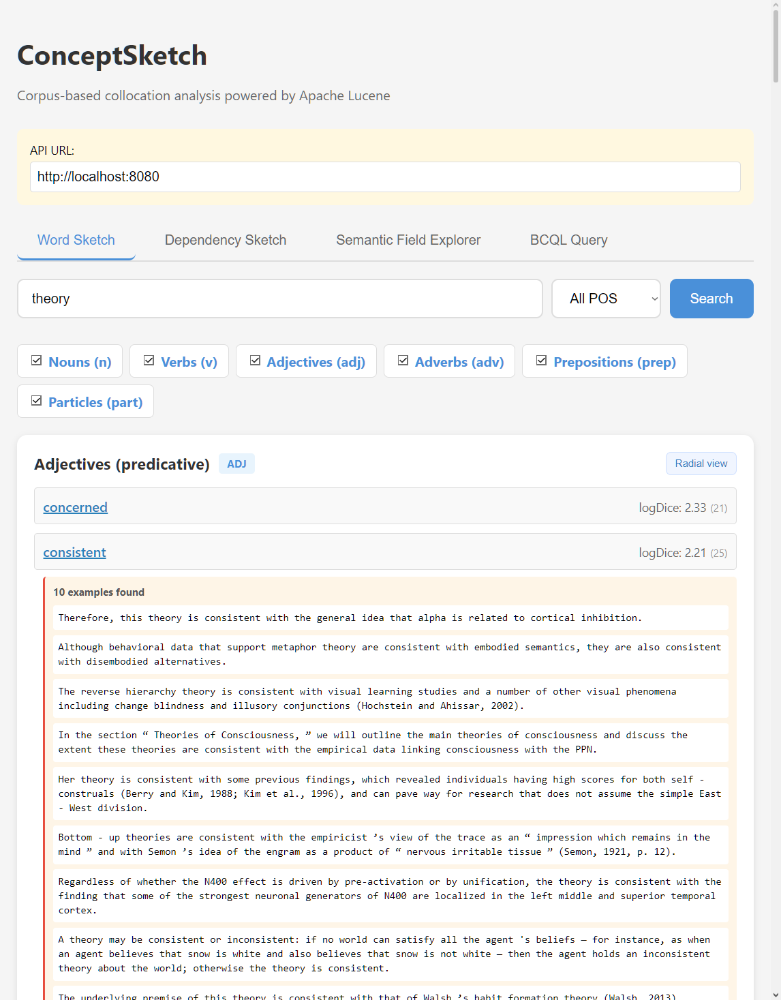
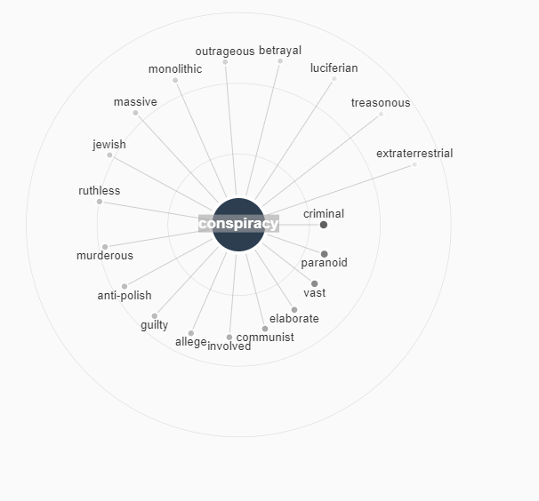
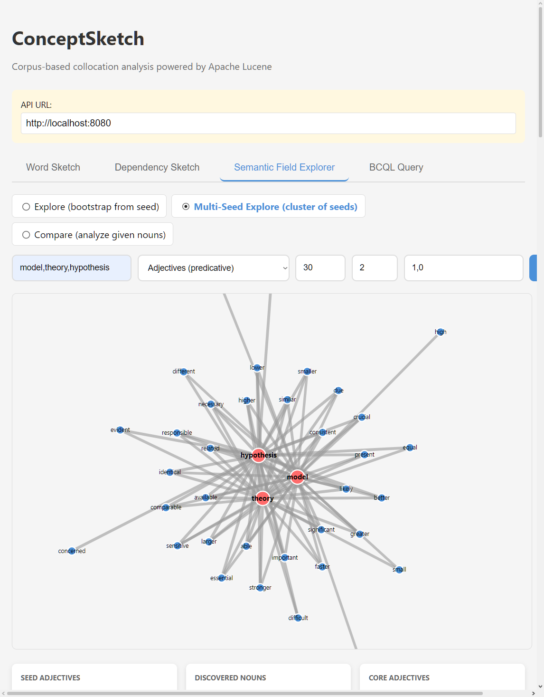

# ConceptSketch

A high-performance corpus-based collocation analysis tool built on [BlackLab](https://blacklab.ivdnt.org/) corpus search software (which relies on Apache Lucene). This project implements word sketch functionality (grammatical relations and collocations) for corpus linguistics research and NLP applications.

**Current Status:** ✅ **Functional Release v1.0** - See [Limitations](#limitations) section.

## Features

- **Fast Collocation Analysis**: O(1) instant lookup with precomputed collocations
- **CQL Support**: Full Corpus Query Language with distance modifiers and constraints
- **logDice Scoring**: Association strength metric (0-14 scale)
- **Multiple Grammatical Relations**: ADJ_PREDICATE, ADJ_MODIFIER, SUBJECT_OF, OBJECT_OF
- **Concordance Examples**: View real corpus sentences for any word pair with highlighting
- **REST API**: HTTP server with semantic field exploration endpoints
- **Web Interface**: Interactive Semantic Field Explorer with D3.js visualization
- **Multi-Seed Exploration**: Explore semantic fields using multiple seed words

## Quick Start (5 minutes)

### Prerequisites

- Java 17+ (Java 21+ recommended)
- Maven 3.6+
- Python 3 (for web server)

### 1. Build

```bash
mvn clean package
```

### 2. Create an Index

#### Step 1 — Prepare a CoNLL-U corpus

Tag your text with any CoNLL-U-producing tool. The project includes a **Stanza GPU script** for efficient tagging:

**Option A: Use the Stanza script (recommended)**

```bash
# Download model (one-time)
python tag_with_stanza.py --download --lang en

# Tag corpus (uses GPU automatically if available)
python tag_with_stanza.py \
  --input corpus.txt \
  --output corpus.conllu \
  --lang en
```

For GPU tuning and more options, see [STANZA_GPU.md](STANZA_GPU.md).

**Option B: Use UDPipe 2 directly**

```bash
udpipe --tokenize --tag --parse --output=conllu english.udpipe corpus.txt > corpus.conllu
```

**Option C: Use another CoNLL-U tagger** (Stanza in Python without GPU, spaCy, etc.)

#### Step 2 — Preprocess: add `<s>` sentence markers

BlackLab's tabular parser requires explicit inline tags for sentence boundaries.
The project ships a script that converts CoNLL-U blank-line sentence boundaries
into `<s>` / `</s>` inline tags:

```bash
python scripts/conllu_to_wpl.py corpus.conllu corpus_s.conllu
```

Move the output file into a dedicated input directory:

```bash
mkdir input_dir
mv corpus_s.conllu input_dir/
```

#### Step 3 — Index with BlackLab

The shaded JAR bundles BlackLab's `IndexTool`. Run it from the project root
(so `--format-dir .` can find `conllu-sentences.blf.yaml`):

```bash
java -cp target/word-sketch-lucene-1.0.1-shaded.jar \
  nl.inl.blacklab.tools.IndexTool create \
  --format-dir . \
  my_index/ input_dir/ conllu-sentences
```

| Argument | Meaning |
|----------|---------|
| `--format-dir .` | Directory containing `conllu-sentences.blf.yaml` |
| `my_index/` | Output index directory (created automatically) |
| `input_dir/` | Directory with preprocessed `.conllu` files |
| `conllu-sentences` | Format name (matches the `.blf.yaml` filename) |

### 3. Start API Server

```bash
# Terminal 1
java -jar target/word-sketch-lucene-1.0.1-shaded.jar server --index my_index/ --port 8080
```

Server startup output:
```
API server started on http://localhost:8080
Algorithm: PRECOMPUTED (O(1) instant lookup)
Endpoints:
  GET /health
  GET /api/sketch/{lemma}
  GET /api/semantic-field/explore
  GET /api/semantic-field/explore-multi
```

### 4. Start Web Interface

```bash
# Terminal 2
python -m http.server 3000 --directory webapp
```

Open browser to: **http://localhost:3000**



The web interface allows to produce some radial plots for collocates:



And you use some semantic exploration features:



### 5. Try a Query

```bash
# Find adjectives describing "house"
curl "http://localhost:8080/api/sketch/house?pos=noun"

# Get example sentences for "house" + "big"
curl "http://localhost:8080/api/concordance/examples?word1=house&word2=big&limit=5"

# Explore semantic field from "theory" (ADJ_PREDICATE relation)
curl "http://localhost:8080/api/semantic-field/explore?seed=theory&relation=adj_predicate"

# Multi-seed exploration
curl "http://localhost:8080/api/semantic-field/explore-multi?seeds=theory,model,hypothesis&top=10"
```

---

## Core Usage

### Index a Corpus

#### Prerequisites
- A corpus in **CoNLL-U format** (columns: ID, FORM, LEMMA, UPOS, XPOS, FEATS, HEAD, DEPREL, DEPS, MISC)
- The project's `conllu-sentences.blf.yaml` format file (in the project root)
- Java 21+ and the shaded JAR (`target/word-sketch-lucene-1.0.1-shaded.jar`)

#### Step 1 — Preprocess CoNLL-U: add sentence markers

BlackLab's tabular parser needs explicit `<s>` / `</s>` inline tags to index
sentence spans. The bundled script converts CoNLL-U blank-line boundaries:

```bash
python scripts/conllu_to_wpl.py corpus.conllu corpus_s.conllu
```

What the script does:
- Skips comment lines (`#`) and multi-word token lines (`1-2`, `1.1`, …)
- Emits `<s>` before the first token of each sentence
- Emits `</s>` after the last token
- Preserves all 10 CoNLL-U columns as tab-separated values

#### Step 2 — Create a BlackLab index

```bash
mkdir input_dir
cp corpus_s.conllu input_dir/

# Run from the project root (so --format-dir finds conllu-sentences.blf.yaml)
java -cp target/word-sketch-lucene-1.0.1-shaded.jar \
  nl.inl.blacklab.tools.IndexTool create \
  --format-dir . \
  my_index/ input_dir/ conllu-sentences
```

To add more documents to an existing index later:

```bash
java -cp target/word-sketch-lucene-1.0.1-shaded.jar \
  nl.inl.blacklab.tools.IndexTool add \
  --format-dir . \
  my_index/ more_input_dir/ conllu-sentences
```

#### Indexed annotations

| Annotation | Source column | Forward index |
|------------|--------------|---------------|
| `word`     | FORM (col 2) | ✓ |
| `lemma`    | LEMMA (col 3) | ✓ |
| `pos`      | UPOS (col 4) | ✓ |
| `xpos`     | XPOS (col 5) | ✓ |
| `deprel`   | DEPREL (col 8) | ✓ |
| `wordnum`  | ID (col 1) | — |
| `feats`    | FEATS (col 6) | — |
| `head`     | HEAD (col 7) | — |

### Query via Command Line

```bash
# Find all collocations for "theory"
java -jar target/word-sketch-lucene-1.0.1-shaded.jar \
  blacklab-query --index my_index/ --lemma theory

# Find adjectival modifiers of "theory" (deprel=amod)
java -jar target/word-sketch-lucene-1.0.1-shaded.jar \
  blacklab-query --index my_index/ --lemma theory --deprel amod
# Increase result count and filter by logDice
java -jar target/word-sketch-lucene-1.0.1-shaded.jar \
  blacklab-query --index my_index/ --lemma theory \
  --deprel nsubj --limit 50 --min-logdice 4.0
```

### Grammar Configuration

The grammar configuration (relations, copulas, CQL patterns) is externalized in JSON:

**Config file:** `grammars/relations.json`

```json
{
  "version": "1.0",
  "copulas": ["be", "appear", "seem", "become", ...],
  "relations": [
    {
      "id": "noun_adj_predicates",
      "name": "Adjectives (predicative)",
      "head_pos": "noun",
      "collocate_pos": "adj",
      "cql_pattern": "[tag=jj.*]",
      "uses_copula": true,
      "default_slop": 8,
      "relation_type": "ADJ_PREDICATE",
      "exploration_enabled": true
    },
    ...
  ]
}
```

**Fields:**
- `id` - Unique relation identifier
- `name` - Human-readable name
- `head_pos` - POS group of the head word (noun, verb, adj)
- `collocate_pos` - POS group of the collocate
- `cql_pattern` - CQL pattern to match
- `uses_copula` - Whether this relation uses copula verbs
- `default_slop` - Default distance window
- `relation_type` - Semantic relation type
- `exploration_enabled` - Whether usable for semantic field exploration

**API endpoint:**
```bash
# Get active grammar configuration
curl http://localhost:8080/api/grammar/active
```

To modify relations or add new ones, edit `grammars/relations.json` and restart the server.

### REST API Endpoints

#### Health Check
```bash
curl http://localhost:8080/health
```

#### Get Word Sketch
```bash
curl "http://localhost:8080/api/sketch/house?pos=noun,verb&limit=15"
```

Response:
```json
{
  "status": "ok",
  "lemma": "house",
  "patterns": {
    "noun_modifiers": {
      "name": "Adjectives modifying (ADJ X)",
      "cql": "[tag=jj.*]~{0,3}",
      "total_matches": 3421,
      "collocations": [
        {
          "lemma": "big",
          "frequency": 287,
          "logDice": 11.24,
          "relativeFrequency": 0.084
        }
      ]
    }
  }
}
```

#### Single-Seed Semantic Field Exploration
```bash
curl "http://localhost:8080/api/semantic-field/explore?seed=theory&relation=adj_predicate&top=15&min_logdice=2"
```

**Relations:**
- `adj_predicate`: "X is ADJ" (e.g., "theory is correct")
- `adj_modifier`: "ADJ X" (e.g., "correct theory")  
- `subject_of`: "X VERBs" (e.g., "theory suggests")
- `object_of`: "VERB X" (e.g., "develop theory")

**Response:**
```json
{
  "status": "ok",
  "seed": "theory",
  "seed_collocates": [
    {"word": "correct", "logDice": 4.21, "frequency": 142},
    {"word": "practical", "logDice": 3.73, "frequency": 98}
  ],
  "discovered_nouns": [
    {
      "word": "development",
      "shared_count": 5,
      "shared_collocates": ["correct", "practical", "quantum"]
    }
  ]
}
```

#### Multi-Seed Semantic Field Exploration
```bash
curl "http://localhost:8080/api/semantic-field/explore-multi?seeds=theory,model,hypothesis&relation=adj_predicate&top=10"
```

**Response:**
```json
{
  "status": "ok",
  "seeds": ["theory", "model", "hypothesis"],
  "seed_collocates_count": 23,
  "common_collocates": [],
  "common_collocates_count": 0,
  "edges": [
    {"source": "theory", "target": "correct", "weight": 4.21, "type": "ADJ_PREDICATE"},
    {"source": "model", "target": "tall", "weight": 3.17, "type": "ADJ_PREDICATE"}
  ]
}
```

#### Concordance Examples for Word Pairs
```bash
curl "http://localhost:8080/api/concordance/examples?word1=house&word2=big&limit=10"
```

Get actual example sentences from the corpus containing both words (lemmas). This feature validates collocations by showing real usage contexts.

#### Diagnostics — collocation integrity
```bash
curl "http://localhost:8080/api/diagnostics/collocation-integrity?top=10"
```

Compares `collocations.bin` entries with the active index and reports suspicious headwords where precomputed collocates are missing from the index or have no supporting span examples. Useful to detect stale or incorrect precomputed data.

**How It Works:**
1. Uses **SpanNearQuery** to efficiently find sentences where both lemmas appear within 10 words
2. Decodes token data (word, lemma, tag, position) from **BinaryDocValues** (`tokens` field)
3. Generates HTML with `<mark>` tags highlighting both target words
4. Returns sentence text, highlighted HTML, and position arrays

**Technical Details:**
- The HYBRID index stores tokens as BinaryDocValues, decoded via `TokenSequenceCodec`
- Lemma field is indexed with positions, enabling fast SpanQueries
- No need to store lemma/word/tag as separate StoredFields - DocValues provide O(1) lookup
- Query complexity: O(log N) for SpanQuery + O(k) for decoding k matching documents

**Parameters:**
- `word1` (required) - First word (lemma)
- `word2` (required) - Second word (lemma)
- `limit` (optional) - Number of examples to return (default: 10)
- `relation` (optional) - Grammatical relation metadata (not used in query)

**Response:**
```json
{
  "status": "ok",
  "count": 3,
  "word1": "house",
  "word2": "big",
  "relation": "",
  "limit_requested": 10,
  "examples": [
    {
      "sentence": "The big house! - The big house.",
      "highlighted": "The <mark>big</mark> <mark>house</mark> ! - The <mark>big</mark> <mark>house</mark> .",
      "raw": "The big house ! - The big house .",
      "word1_positions": [2, 7],
      "word2_positions": [1, 6]
    },
    {
      "sentence": "Houses Big and beautiful house with 4 bedrooms Houses big...",
      "highlighted": "<mark>Houses</mark> <mark>Big</mark> and beautiful <mark>house</mark> with 4 bedrooms <mark>Houses</mark> <mark>big</mark> ...",
      "raw": "Houses Big and beautiful house with 4 bedrooms Houses big ...",
      "word1_positions": [0, 4, 8],
      "word2_positions": [1, 9]
    }
  ]
}
```

**Response Fields:**
- `sentence` - Raw sentence text from the corpus
- `highlighted` - HTML with `<mark>` tags around matching words
- `raw` - Tokenized sentence (space-separated)
- `word1_positions` - Array of token positions where word1 appears (0-indexed)
- `word2_positions` - Array of token positions where word2 appears (0-indexed)

**Use Cases:**
- Validate collocations before citing in research
- Understand usage contexts and frequency patterns
- Discover idiomatic expressions and multi-word units
- Quality check corpus tagging and lemmatization

**Integration with Web UI:**
- **Word Sketch tab**: Click any collocation word to see inline examples
- **Semantic Field Explorer**: Click graph edges to see example sentences
- Examples appear in expandable panels below the visualization
- Up to 10 examples shown with "Load More" option for additional contexts

---

## Web Interface (Semantic Field Explorer)

The `webapp/` directory contains an interactive web interface built with D3.js.

### Features

1. **Word Sketch Search**
   - Browse collocations for any lemma
   - Filter by POS tags
   - **Click any collocation to see example sentences** from the corpus
   - Examples appear in a panel below with highlighted target words
   - Adjust logDice thresholds

2. **Single-Seed Exploration**
   - Bootstrap from one seed word
   - Select grammatical relation
   - Discover semantically similar words
   - Force-directed graph visualization

3. **Multi-Seed Exploration** (NEW)
   - Explore from multiple seeds at once
   - See all collocates per seed
   - Identify common patterns
   - Cluster-based semantic field analysis

### Start Both Services

```bash
# Terminal 1: API Server
java -jar target/word-sketch-lucene-1.5.0.jar server --index <corpus_path> --port 8080

# Terminal 2: Web Server
python -m http.server 3000 --directory webapp

# Open browser to http://localhost:3000
```

---

## CQL Pattern Syntax

### Basic Patterns

| Pattern | Meaning |
|---------|---------|
| `"house"` | Match lemma "house" |
| `[tag="NN.*"]` | Match POS tag regex (nouns) |
| `[tag="JJ"]` | Match exact POS tag |
| `[word="the"]` | Match word form |

### Constraints

```cql
[tag="JJ.*"]              # Adjectives (any type)
[tag="VB.*"]              # Verbs (any type)
[tag="NN.*"]              # Nouns
[tag!="NN.*"]             # NOT nouns
[tag="JJ"|tag="RB"]       # Adjectives OR adverbs
```

### Distance Modifiers

```cql
[tag="JJ"]                # Adjacent (distance = 1)
[tag="JJ"] ~ {0,3}        # Within 0-3 words
[tag="JJ"] ~ {1,5}        # 1-5 words apart
```

### Examples

```cql
# Adjectives modifying a noun
[tag="jj.*"]

# Verbs taking noun as object
[tag="vb.*"]

# Adjectives within 3 words
[tag="jj.*"] ~ {0,3}
```

---

## Architecture

### Query Pipeline

```
User Input
    ↓
CQL Pattern Parser (CQLParser.java)
    ↓
Lucene SpanQuery Compiler (CQLToLuceneCompiler.java)
    ↓
Index Lookup (Lucene)
    ↓
logDice Scorer (LogDiceCalculator.java)
    ↓
Response (JSON/HTML)
```

### Index Structure

| Field | Type | Purpose |
|-------|------|---------|
| `doc_id` | Numeric, stored | Sentence ID |
| `position` | Numeric, stored | Word position |
| `word` | Stored | Raw word form |
| `lemma` | Indexed | Lemma for search |
| `tag` | Keyword, indexed | POS tag (NN, JJ, VB, etc.) |
| `pos_group` | Keyword | Broad category (noun/verb/adj/adv) |
| `sentence` | Stored | Full sentence |

### Collocation Computation

#### logDice (Default)
```
logDice = log₂(2 * f(A,B) / (f(A) + f(B))) + 14
```
- Scale: 0-14 (14 = perfect association)
- Symmetric measure - same value regardless of direction

#### MI3 (Mutual Information)
```
MI3 = log₂((f(A,B) * N) / (f(A) * f(B)))
```
- Higher values indicate stronger association
- Good for finding rare but informative collocations

#### T-Score
```
T = (f(A,B) - expected) / sqrt(expected)
where expected = (f(A) * f(B)) / N
```
- Measures statistical significance
- Higher absolute values indicate more significant associations

#### Log-Likelihood (G-squared)
```
G2 = 2 * f(A,B) * log(f(A,B) / expected)
```
- Measures deviance from expected co-occurrence
- Higher values indicate greater statistical significance

**Parameters:**
- `f(A,B)` = co-occurrence frequency (collocate with headword)
- `f(A)` = headword frequency
- `f(B)` = collocate total frequency
- `N` = total tokens in corpus

**Query API:**
```bash
# Default logDice
curl "http://localhost:8080/api/sketch/house?scoring=logDice"

# MI3 scoring
curl "http://localhost:8080/api/sketch/house?scoring=mi3"

# T-Score
curl "http://localhost:8080/api/sketch/house?scoring=tscore"

# Log-Likelihood
curl "http://localhost:8080/api/sketch/house?scoring=loglikelihood"
```

---

## Project Structure

```
word-sketch-lucene/
├── src/main/java/pl/marcinmilkowski/word_sketch/
│   ├── Main.java                    # CLI entry point
│   ├── api/
│   │   └── WordSketchApiServer.java # REST API server
│   ├── grammar/
│   │   ├── CQLParser.java           # CQL pattern parsing
│   │   └── CQLPattern.java          # Pattern representation
│   ├── indexer/
│   │   ├── hybrid/
│   │   │   ├── HybridIndexer.java   # HYBRID index creation
│   │   │   ├── TokenSequenceCodec.java # Token encoding/decoding
│   │   │   ├── CollocationsBuilder.java # Precomputed collocations
│   │   │   └── SentenceDocument.java # Document model
│   │   └── LuceneIndexer.java       # Legacy indexer
│   ├── query/
│   │   ├── CQLToLuceneCompiler.java # CQL → Lucene translation
│   │   ├── HybridQueryExecutor.java # Query execution (PRECOMPUTED)
│   │   ├── ConcordanceExplorer.java # Concordance examples (SpanQuery)
│   │   ├── SemanticFieldExplorer.java # Single-seed exploration
│   │   ├── SnowballCollocations.java # Multi-seed exploration
│   │   └── WordSketchQueryExecutor.java # Legacy executor
│   ├── tagging/
│   │   ├── SimpleTagger.java        # Rule-based tagger
│   │   ├── ConllUProcessor.java     # CoNLL-U parsing
│   │   └── UDPipeTagger.java        # UDPipe wrapper
│   └── utils/
│       └── LogDiceCalculator.java   # logDice scoring
├── webapp/
│   ├── index.html                   # Web UI (D3.js visualization)
│   └── assets/                      # CSS, D3.js
├── src/test/java/                   # Unit tests
├── pom.xml                          # Maven config
└── README.md                        # This file
```

---

## Technical Deep Dive

### Concordance Examples Implementation

The concordance feature efficiently retrieves example sentences containing word pairs using a two-stage approach:

**Stage 1: SpanQuery for Fast Document Retrieval**
```java
// Build SpanNearQuery: both lemmas within 10 words
SpanTermQuery span1 = new SpanTermQuery(new Term("lemma", "house"));
SpanTermQuery span2 = new SpanTermQuery(new Term("lemma", "big"));

SpanNearQuery nearQuery = SpanNearQuery.newUnorderedNearQuery("lemma")
    .addClause(span1)
    .addClause(span2)
    .setSlop(10)  // Max distance: 10 tokens
    .build();

TopDocs results = searcher.search(nearQuery, limit);
```

**Stage 2: DocValues Decoding for Token Details**
```java
// For each matching document, decode tokens from BinaryDocValues
BinaryDocValues tokensDV = reader.getBinaryDocValues("tokens");
tokensDV.advanceExact(docId);
BytesRef tokensBytes = tokensDV.binaryValue();

// Decode using TokenSequenceCodec
List<Token> tokens = TokenSequenceCodec.decode(tokensBytes);

// Each token contains: position, word, lemma, tag, startOffset, endOffset
```

**Why This Design?**

1. **Compact Storage**: Tokens stored as binary (varint encoding) instead of separate fields
   - Typical sentence (~20 tokens): 400-600 bytes vs 1-2KB for separate fields
   - 62M sentence corpus: ~30GB vs ~80GB storage

2. **Fast Retrieval**: 
   - SpanQuery uses inverted index with positions → O(log N) lookup
   - DocValues provide O(1) document access (memory-mapped)
   - No need to reconstruct from stored text

3. **Position Accuracy**: 
   - Positions preserved from tagging pipeline
   - Support for multi-word tokens and contractions
   - Exact alignment with original text offsets

**Binary Encoding Format** (TokenSequenceCodec):
```
[token_count: varint]
For each token:
  [position: varint]
  [word_length: varint][word: UTF-8]
  [lemma_length: varint][lemma: UTF-8]
  [tag_length: varint][tag: UTF-8]
  [start_offset: varint]
  [end_offset: varint]
```

Varint encoding saves space for common cases (positions < 128 = 1 byte).

## Examples

correct (logDice: 4.21)

## Dependency Sketches

### What are Dependency Sketches?
Dependency sketches are visual or data-driven representations of how words relate to each other based on syntactic dependencies in the corpus. They help users understand grammatical and semantic relationships beyond simple collocations, leveraging dependency parsing to reveal patterns such as subject, object, modifier, and predicate relations.

### Usage
Dependency sketches are generated from parsed corpora (e.g., CoNLL-U format) and can be explored via the API and web UI. They provide insights into grammatical structures and are useful for linguistic analysis, semantic field exploration, and advanced querying.

### Example
For the noun "theory", a dependency sketch might show its typical subjects, objects, and modifiers, visualized as a graph or listed in ranked tables.

See also: [MULTI_SEED_EXPLORATION.md](MULTI_SEED_EXPLORATION.md) for advanced semantic field features.
practical (logDice: 3.73)
wrong (logDice: 3.58)
mathematical (logDice: 3.47)
quantum (logDice: 2.89)
```

### Example 2: Find Words "House" Can Be Object Of

```bash
curl "http://localhost:8080/api/semantic-field/explore?seed=house&relation=object_of&top=10"
```

**Result:** Find verbs that take "house" as object
```
locate (logDice: 5.12)
build (logDice: 4.89)
buy (logDice: 4.21)
```

Discovered nouns (words that share these verbs):
```
hotel (shared: build, locate)
apartment (shared: build, buy, locate)
property (shared: buy, locate)
```

### Example 3: Multi-Seed Cluster Analysis

```bash
curl "http://localhost:8080/api/semantic-field/explore-multi?seeds=dog,cat,horse&relation=subject_of&top=8"
```

**Result:** What do dogs, cats, and horses do?
```
All seeds can: eat, run, live
Dog-specific: bark, beg, fetch
Cat-specific: meow, purr, scratch
```
---

## Limitations

This is a **functional v1.5 release** with the following limitations:

### Known Limitations

1. **No Agreement Rules**: Patterns don't enforce grammatical agreement
   - "big house" and "the big house" are treated the same
   - Consider this for interpretation of results

2. **Fixed Grammatical Relations**: Only 4 relation types implemented
   - `ADJ_PREDICATE`, `ADJ_MODIFIER`, `SUBJECT_OF`, `OBJECT_OF`
   - Custom patterns require CQL specification

3. **Limited Lemma Coverage**: Depends on the input corpus
   - Low-frequency words may have insufficient data
   - Compounds and rare morphological forms may not be covered

4. **No Morphological Analysis**: Simple POS tag matching
   - Plural/singular not distinguished
   - Verb tense merged into single lemma

---

## Development

### Run Tests

```bash
mvn test
```

### Build Documentation

See `plans/` directory for:
- `word-sketch-lucene-spec.md` - Overall technical specification
- `precomputed-collocations-spec.md` - Precomputed algorithm details
- `hybrid-index-spec.md` - Hybrid index architecture

### Code Quality

Tests cover:
- CQL parsing (50+ patterns)
- Lucene query compilation
- logDice calculation
- API endpoints
- Multi-seed exploration

---

